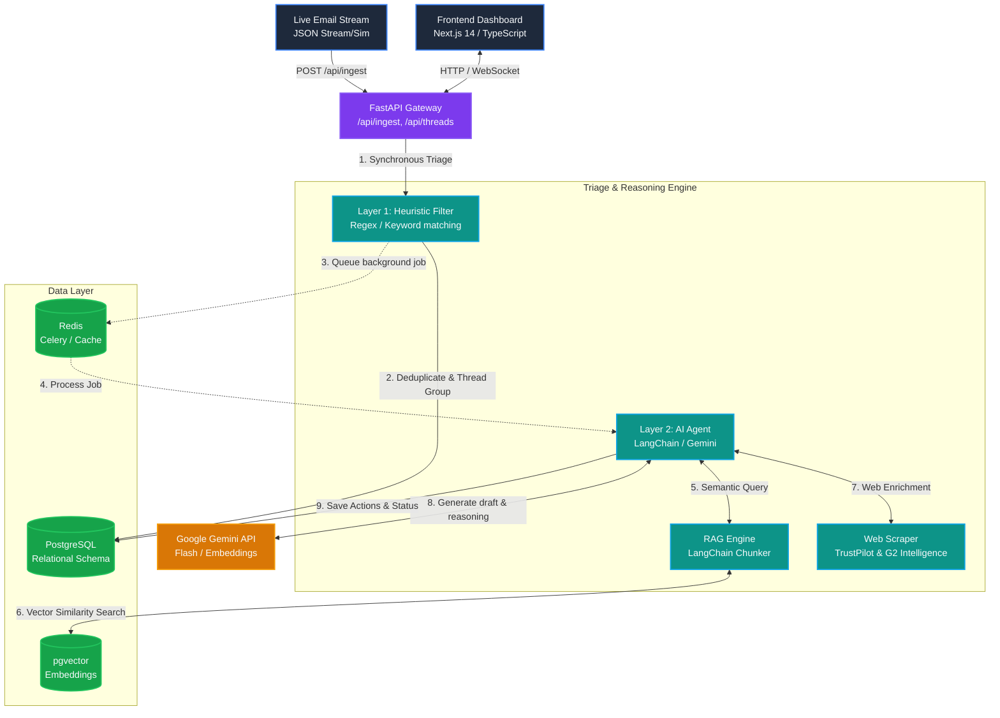
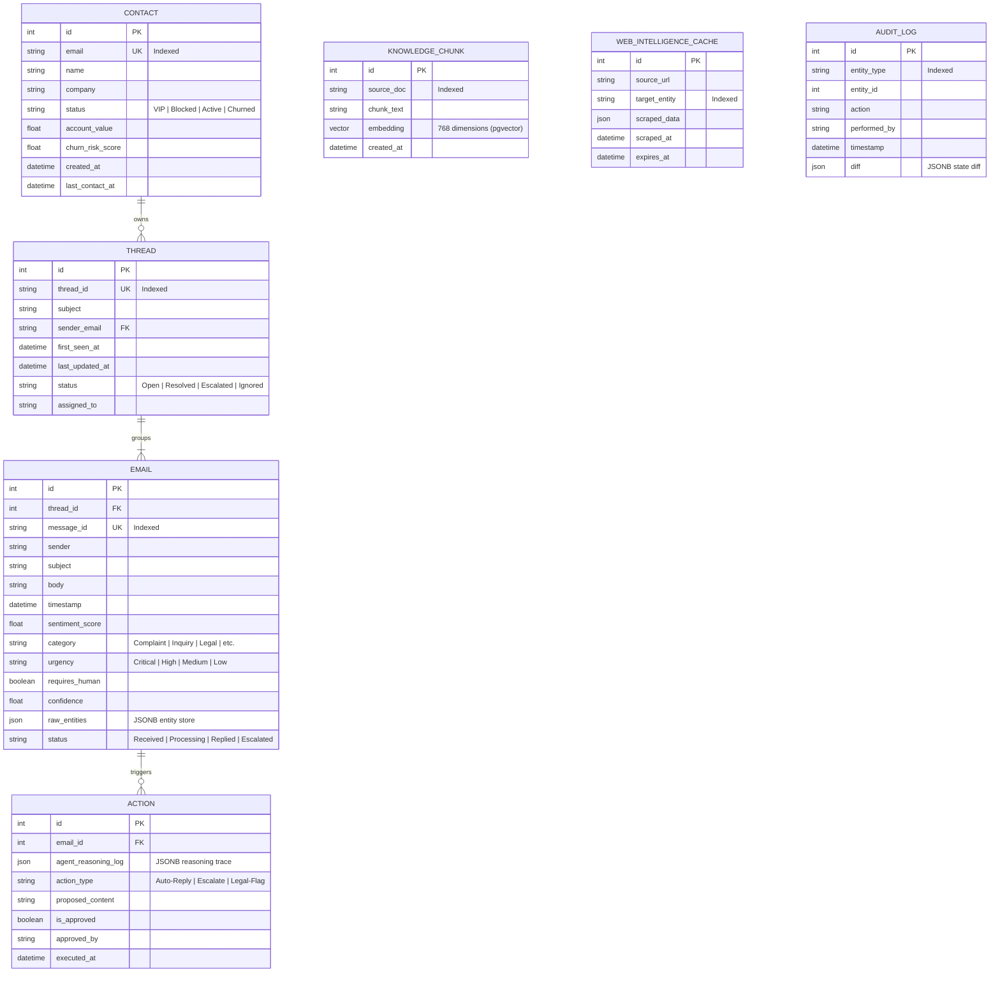

#Name: Rupesh Belhekar
#College: VIIT
#PRN No: 22210091

# SenAI Agentic CRM Intelligence Platform

Welcome to the **SenAI Agentic CRM Intelligence Platform** – a modern, high-end CRM that integrates real-time email ingestion, synchronous and asynchronous multi-layer intelligence (triage), Vector Retrieval-Augmented Generation (RAG), and a dark-mode glassmorphic interface for operator-in-the-loop review.

---

## 1. System Architecture

The platform is designed to process incoming emails using a multi-layer pipeline:
1. **Ingest Gateway**: Accepts raw email JSON payloads, enforces deduplication based on `message_id`, creates contact profiles, and groups emails into conversation threads.
2. **Layer 1 Heuristics (Synchronous Triage)**: Operates instantly during ingest to catch critical vulnerabilities or P0 outages (e.g. ransomware, system down) before the LLM runs.
3. **Queue**: Delegates heavy LLM classification and tool calling to a background worker queue.
4. **Layer 2 AI Agent (Asynchronous Triage & RAG)**: Leverages **Google Gemini** to classify categories, compute sentiment, extract entities, perform semantic RAG search against policy docs, and draft automated replies.
5. **Human-in-the-Loop Operator UI**: Provides a responsive, glassmorphic Next.js interface for manual edits, review, approval, and real-time operations.

### Architecture Flow Diagram



---

## 2. Database Design & SQL Schema

The database uses PostgreSQL with `pgvector` enabled for vector similarity search. We track relations between contacts, conversation threads, individual emails, agent actions (drafts/escalations), web scrapers caches, and system modifications (audit logs).

### Entity Relationship (ER) Diagram



### Table Definitions & Column Metadata

#### 1. `contacts`
Tracks customer profiles, lifetime values, and churn risk markers.
* **`id`** (`Integer`, PK, Autoincrement): Unique database key.
* **`email`** (`String`, Unique, Index): Contact's email address.
* **`name`** (`String`, Nullable): Contact's full name.
* **`company`** (`String`, Nullable): Customer's organization.
* **`status`** (`String`, Default: `'Active'`): Lifecycle state (`VIP`, `Blocked`, `Active`, `Churned`).
* **`account_value`** (`Float`, Default: `0.0`): ARR or Account contract value.
* **`churn_risk_score`** (`Float`, Default: `0.0`): AI calculated churn probability (0.0 to 1.0).
* **`created_at`** (`DateTime`): Timestamp when profile was created.
* **`last_contact_at`** (`DateTime`, Nullable): Timestamp of the last processed incoming email.

#### 2. `threads`
Groups email exchanges into clean, unified conversation threads.
* **`id`** (`Integer`, PK, Autoincrement): Unique database key.
* **`thread_id`** (`String`, Unique, Index): External thread identifier.
* **`subject`** (`String`): Email subject line.
* **`sender_email`** (`String`, Index): Originating customer's email.
* **`first_seen_at`** (`DateTime`): Time the thread was initiated.
* **`last_updated_at`** (`DateTime`): Time of the latest message activity.
* **`status`** (`String`, Default: `'Open'`): Thread status (`Open`, `Resolved`, `Escalated`, `Ignored`).
* **`assigned_to`** (`String`, Nullable): Assigned operator or department.

#### 3. `emails`
Stores raw content and classification intelligence metadata for each message.
* **`id`** (`Integer`, PK, Autoincrement): Unique database key.
* **`thread_id`** (`Integer`, FK -> `threads.id`): Back-reference to the parent thread.
* **`message_id`** (`String`, Unique, Index): Global email identifier (used for deduplication).
* **`sender`** (`String`): Email address of sender.
* **`subject`** (`String`): Subject line.
* **`body`** (`String`): Message content (truncated to 10,000 characters).
* **`timestamp`** (`DateTime`): Email sent timestamp.
* **`sentiment_score`** (`Float`, Nullable): Calculated sentiment score (-1.0 to 1.0).
* **`category`** (`String`, Nullable): Auto-assigned classification category.
* **`urgency`** (`String`, Nullable): Priority level (`Critical`, `High`, `Medium`, `Low`).
* **`requires_human`** (`Boolean`, Default: `False`): Flag indicating if manual operator review is mandatory.
* **`confidence`** (`Float`, Nullable): LLM confidence score (0.0 to 1.0).
* **`raw_entities`** (`JSON`, Nullable): Extracted data entities (e.g. order numbers, accounts).
* **`status`** (`String`, Default: `'Received'`): Lifecycle status (`Received`, `Processing`, `Replied`, `Escalated`).

#### 4. `actions`
Stores agent reasoning outputs, decision traces, and proposed auto-responses.
* **`id`** (`Integer`, PK, Autoincrement): Unique database key.
* **`email_id`** (`Integer`, FK -> `emails.id`): Reference to the email that triggered the action.
* **`agent_reasoning_log`** (`JSON`): List of logical thoughts and observations generated by the LLM.
* **`action_type`** (`String`): Intended operation (`Auto-Reply`, `Escalate`, `Legal-Flag`, `Ticket-Created`, `Ignored`).
* **`proposed_content`** (`String`, Nullable): Drafted auto-reply response text.
* **`is_approved`** (`Boolean`, Default: `False`): Approval flag for operator override.
* **`approved_by`** (`String`, Nullable): Username of operator who signed off on the draft.
* **`executed_at`** (`DateTime`, Nullable): Timestamp indicating when the draft response was sent.

#### 5. `knowledge_chunks`
Vector store for policy document indexing.
* **`id`** (`Integer`, PK, Autoincrement): Unique database key.
* **`source_doc`** (`String`, Index): Source policy file name (e.g. `sla_policy.md`).
* **`chunk_text`** (`String`): Text block content.
* **`embedding`** (`vector(768)`): PGVector representation generated using Google Gemini Embedding model.
* **`created_at`** (`DateTime`): Creation timestamp.

#### 6. `web_intelligence_cache`
Caches external scraped customer details (Trustpilot / G2 indicators) to bypass scraping limits.
* **`id`** (`Integer`, PK, Autoincrement): Unique database key.
* **`source_url`** (`String`): Target scraped URL.
* **`target_entity`** (`String`, Index): Target customer or domain name.
* **`scraped_data`** (`JSON`): Scraped structured values.
* **`scraped_at`** (`DateTime`): Scraping execution date.
* **`expires_at`** (`DateTime`): Cache expiration timestamp.

#### 7. `audit_log`
Ensures traceability of manual changes and actions.
* **`id`** (`Integer`, PK, Autoincrement): Unique database key.
* **`entity_type`** (`String`, Index): Affected model class (e.g. `Thread`, `Action`).
* **`entity_id`** (`Integer`): Database key of target row.
* **`action`** (`String`): Operation performed (e.g. `'APPROVE'`, `'REPLY'`).
* **`performed_by`** (`String`): Name of operator who triggered the action.
* **`timestamp`** (`DateTime`): Log entry timestamp.
* **`diff`** (`JSON`, Nullable): State changes in JSON delta representation.

---

## 3. Project Configuration & Local Setup

### Prerequisites
* **Docker & Docker Compose** (Installed on host)
* **Node.js 18+** (If running frontend natively)
* **Python 3.11+** (If running backend natively)

### Environment Variables
Configure your environment variables by editing the `.env` file in the root directory:
```env
GEMINI_API_KEY=AIzaSy...your_gemini_api_key...
DATABASE_URL=postgresql+asyncpg://senai:senai_password@db:5432/senai_crm
```

### Running with Docker Compose
To build and launch all service containers (Postgres Database with `pgvector`, Redis cache, FastAPI backend, Next.js frontend dashboard, and Celery background workers):
```bash
docker-compose up --build
```
* **FastAPI Backend Gateway**: Available at [http://localhost:8000](http://localhost:8000) (Interactive Swagger docs: [http://localhost:8000/docs](http://localhost:8000/docs))
* **Frontend Web Dashboard**: Available at [http://localhost:3000](http://localhost:3000)

### Database Migrations
Migrations are handled using **Alembic**. The system is stamped with version `b9304f5106b5` at startup. If you wish to manage migrations or apply schema upgrades manually:
```bash
# Enter virtual environment
.venv\Scripts\activate

# Apply migrations
cd backend
alembic upgrade head
```

---

## 4. Seeding & Live Simulation

### 1. Seeding Knowledge Base (RAG)
The 6 Markdown files (`pricing_policy.md`, `sla_policy.md`, `refund_policy.md`, `api_docs.md`, `compliance_faq.md`, `escalation_matrix.md`) are located under [backend/knowledge_base](file:///d:/Acadmics/SenAI/senai-crm/backend/knowledge_base).
* **Automatic Ingestion**: On application startup, the backend automatically calls `setup_rag()` to read, chunk (using `RecursiveCharacterTextSplitter`), embed, and upload these files into the `knowledge_chunks` database table.

### 2. Simulating the Email Stream
To stream real customer scenario emails into the system, execute the seeding script from the root workspace folder:
```bash
.venv\Scripts\python seed_emails.py
```
This loads [email-data-advanced.json](file:///d:/Acadmics/SenAI/senai-crm/email-data-advanced.json) and streams each email to the ingest endpoint one-by-one with a small delay to simulate real-time processing.

### 3. Resetting the System State
If you want to wipe the database and queues clean to record a new simulation from scratch:
```bash
# Shutdown containers and purge volumes
docker-compose down -v

# Relaunch the environment fresh
docker-compose up --build
```

---

## 5. Walkthrough & Assessment Scenarios

Use this checklist during your screen recording to walk through the system's core capabilities:

### Scenario 1: Email Stream Ingestion
* Trigger `python seed_emails.py` in a separate terminal.
* Observe emails being accepted by `/api/ingest`.
* Verify that duplicates are safely ignored with an `ignored (duplicate)` status message, showing idempotency works.

### Scenario 2: Bob's Outage Escalation & Layer 1 Priority
* In the dashboard, click on **Bob Jones' outage thread** (`thread_bob_outage`).
* Explain that Layer 1 heuristics synchronously marked this email as **Critical** urgency immediately on ingest because of keyword matches ("production server is not responding", "P0").
* Point to the **Explainable AI** panel to show matching RAG document retrieved from `sla_policy.md` (identifying the 15-minute response SLA commitment).

### Scenario 3: RAG Retrieval Debug View
* Highlight the **Explainable AI Diagnostics** panel on the right sidebar.
* Show the raw retrieved chunks, similarity confidence score, and LLM entity extractions (like the incident urgency and requires_human triggers).

### Scenario 4: Karen Churn Scenario with Web Intelligence
* Click on **Karen Davis' billing dispute/churn thread** (`thread_karen_churn`).
* Observe that the agent triggered the **Web Intelligence Scraper** to pull sentiment and public scores from G2/TrustPilot.
* Identify the **High Risk** warning flag and customer value metrics dynamically rendered on her Contact Card.

### Scenario 5: Real-time Analytics Dashboard
* Navigate to the **Intelligence & Analytics** page using the sidebar navigation.
* Verify the Recharts visualizations displaying category distributions, sentiment trend lines, urgency rates, and the SLA compliance speed gauges.

---

## 6. Architecture Decisions & Trade-Offs

### 1. Hybrid Multi-Layer Triage
* **Decision**: We run Regex/Keyword parsing synchronously inside the gateway, followed by deep LLM reasoning asynchronously.
* **Trade-Off**: Adding Layer 1 heuristics prevents system latency issues. If the Gemini API is rate-limited, critical outages (like Bob's server issue) are still immediately marked as **Critical** in our database, alerting operators even before the LLM generates a response draft.

### 2. Unified Storage (PostgreSQL + pgvector)
* **Decision**: We chose pgvector instead of setting up a separate vector database instance like Pinecone or Milvus.
* **Trade-Off**: Eliminates the overhead of maintaining two database setups. Transactions remain atomic, and relational contact information can be easily queried alongside vectors.

### 3. Operator-in-the-Loop Override
* **Decision**: Automated agent responses require approval before sending, except when classified as safe low-risk inquiries. Operators have a unified text editor to review and tweak drafts.
* **Trade-Off**: Introduces minor human delays but ensures high response quality and safety for compliance, refund requests, or legal issues.

---

## 7. Known Limitations

* **Gemini API Key Dependency**: If the Gemini API key is missing or encounters a rate limit, the Layer 2 agent will gracefully fail. The system handles this by creating an Escalation ticket with a standard fallback email template so operations are never blocked.
* **Scraper Caching**: The TrustPilot web scraper is simulated to avoid rate blocks and IP bans. In production, this would integrate with a premium proxy scraper service or official APIs.
